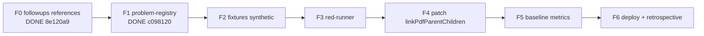

# Handoff: PDF spec variant-children fix (Вариант 1)

**Дата:** 2026-05-13
**Статус:** в работе, F0+F1 закрыты, готовы к F2
**Передаётся:** новому агенту (любая модель, рекомендуется Claude Opus 4.7 как для оркестратора, см. §6)
**Источник:** локальный план `pdf_spec_variant-children_fix_22290548` (хранится в `.cursor/plans/` на машине автора, согласно [docs/plans/README.md](../README.md) §5; в репо НЕ коммитится — поэтому всё необходимое перенесено в этот handoff).

---

## 1. Зачем этот документ

Передаю работу следующему агенту со свежим контекстом. По правилу [.cursor/rules/context.mdc](../../.cursor/rules/context.mdc) перед `/clear` сохраняем прогресс в handoff. Этот файл — самодостаточный: новый агент сможет стартовать с него, не имея доступа к моему локальному `.cursor/plans/`.

---

## 2. Бизнес-контекст и проблема (одной страницей)

- Продукт — автоматизация сметы строительной компании (см. [.business/SUMMARY.md](../../../.business/SUMMARY.md), [.business/products/product-1.md](../../../.business/products/product-1.md), [.business/goals/kpi.md](../../../.business/goals/kpi.md)).
- KPI: ≥80% позиций спецификации парсятся автоматически, ≥85% match accuracy. Текущий поток: 4–5 проектов/мес, цель — 15–20.
- Регрессия: на радиаторном PDF-проекте теряется ~15 позиций variant-children (например, `C11-300-500`, `C21-500-1200`) — у дочерних строк нет `position_number`, поэтому `linkPdfParentChildren` в [backend/src/services/gigachatSpecFromPdf.ts](../../../backend/src/services/gigachatSpecFromPdf.ts) их не привязывает к родителю и они выпадают из спеки.
- Корень: ветка parametrized-child требует `item.position_number !== null`. Это продолжение parent/child фикса из [retrospectives/12.05.26_фаза-8.3_pdf-parent-child-hotfix.md](../../../retrospectives/12.05.26_фаза-8.3_pdf-parent-child-hotfix.md), но для нового регресс-сценария.
- Принятое решение — **Вариант 1** из экспертного заключения: точечная правка `linkPdfParentChildren` + регрессионный набор. Варианты 2 (`spec_parser_overrides`) и 3 (Gemini verifier) отложены и зафиксированы в [docs/plans/references/2026-05-12_pdf_spec_parent_child_followups.md](2026-05-12_pdf_spec_parent_child_followups.md).
- Зарегистрирован как `PRB-008` в [docs/problem-registry.yaml](../../problem-registry.yaml), priority **P0** (severity 3.6, priority_score 4.05), due `2026-05-19`.

---

## 3. Где мы сейчас остановились

Ветка: `main`, ahead of `origin/main` by **3 commits**, working tree **clean**, **не запушено**.

Закрытые фазы:

| Фаза | Что сделано | Коммит |
|------|-------------|--------|
| F0 | `docs/plans/references/2026-05-12_pdf_spec_parent_child_followups.md` создан, ссылка добавлена в [docs/plans/STATUS.md](../STATUS.md). 5-ходовый цикл прошёл, в Ходе 5 пойман и исправлен Windows-абсолютный путь (PRB-002). | `8e120a9` |
| F1 | `PRB-008` зарегистрирован в [docs/problem-registry.yaml](../../problem-registry.yaml), [docs/problem-registry-report.md](../../problem-registry-report.md) перегенерирован, в [retrospectives/12.05.26_pdf-позиции-экспертное-заключение.md](../../../retrospectives/12.05.26_pdf-позиции-экспертное-заключение.md) добавлена обратная ссылка на PRB-008 (двусторонняя навигация). 5-ходовый цикл выявил и исправил 5 реальных проблем (англ. title, пустой due_date, нехватка ссылок/контекста, неудачный next_action). | `c098120` |
| (предыдущий) | parent/child hotfix + GigaChat timeouts (ретро 8.3) | `1ef5dad`, `391e16a` |

**Открытые фазы (по порядку):** F2 → F3 → F4 → F5 → F6.

**Что делать первым:** дождаться от пользователя триггер-фразы `Реализуй фазу F2 по плану` и запустить F2 (см. §5).

---

## 4. Карта плана (фазы и зависимости)



Принцип: **одна фаза = один субагент = один scope = один коммит** (правило ретро 8.2 + согласованная стратегия α — per-phase commits для трассируемости).

### F2 — Синтетические фикстуры (СЛЕДУЮЩАЯ)
- **Цель:** положить набор PDF + ожидаемый JSON в `backend/tests/fixtures/spec-pdf/`.
- **Файлы (ожидаемые):**
  - `backend/tests/fixtures/spec-pdf/01_radiator_variants_no_position.pdf` (генератор `pdfkit` уже в devDependencies)
  - `backend/tests/fixtures/spec-pdf/01_radiator_variants_no_position.expected.json`
  - `02_dn_children.pdf` + `.expected.json`
  - `03_to_zhe_children.pdf` + `.expected.json`
  - `04_mixed.pdf` + `.expected.json` (DN + variants одновременно)
  - `05_negative_no_parent_variant.pdf` + `.expected.json` (variant без родителя — НЕ должен привязаться)
  - `README.md` со списком и хешами
  - `_gen.mjs` — детерминированный генератор (фиксированный seed)
- **Acceptance criteria:**
  1. 5 PDF + 5 JSON в git, ≤ 200 KB каждый.
  2. `expected.json` содержит ВСЕ поля `SpecificationRow` (`position_number`, `name`, `characteristics`, `unit`, `quantity`, `full_name`, `_parentIndex`).
  3. Кейс 01 — радиаторный со скриншота клиента (С 11 + 13 типоразмеров, С 21 + 2 типоразмера).
  4. Никаких реальных персональных данных / ИНН / БИК.
  5. Перезапускаемость: `node backend/tests/fixtures/spec-pdf/_gen.mjs` → побитово тот же PDF (или фиксируем хеши в README).
- **План проверки:**
  - `node backend/tests/fixtures/spec-pdf/_gen.mjs` → exit 0.
  - `git diff --stat backend/tests/fixtures/` → ожидаемый перечень.
- **Субагент:** `generalPurpose`. НЕ запускает `parseSpecFromPdf` (того ещё не правили, оно сейчас падает по сценарию).
- **Критическая нота:** в Ходе 5 цикла особенно проверить, что фикстуры синтетические, без реальных данных.

### F3 — Регрессионный runner (red-first)
- **Цель:** standalone-скрипт прогонки фикстур через `parseSpecFromPdf` с замоканным GigaChat.
- **Файлы:**
  - `scripts/test-spec-parent-child.mjs` — runner: читает фикстуры, мокает GigaChat ответ (берёт из `*.gigachat-response.json` рядом с PDF), вызывает `mapPdfItemsToRows` и `linkPdfParentChildren` из [backend/src/services/gigachatSpecFromPdf.ts](../../../backend/src/services/gigachatSpecFromPdf.ts), сравнивает с `expected.json`, печатает diff.
  - В каждый фикстур-каталог положить `*.gigachat-response.json` (детерминированный ожидаемый ответ модели) — это дополнение к F2.
  - Правка `backend/package.json`: добавить `"test:spec-pdf": "node ../scripts/test-spec-parent-child.mjs"`.
- **Acceptance criteria:**
  1. `cd backend && npm run test:spec-pdf` запускается без живого GigaChat (no network).
  2. На текущем (НЕ правленом) коде runner ПАДАЕТ ровно на кейсе 01 (radiator) — это red-first фиксация бага.
  3. Кейсы 02, 03, 05 — проходят.
  4. Кейс 04 (mixed) может падать частично — фиксируем что именно.
  5. Скрипт печатает: `PASS/FAIL <fixture> <diff>` и финальную сводку, exit code = 1 если есть FAIL.
- **План проверки:** `cd backend && npm run test:spec-pdf` → exit 1, в выводе явно: FAIL 01_radiator (+ возможно 04 partial), PASS 02/03/05.
- **Субагент:** `generalPurpose`. Scope = только `scripts/` + `backend/package.json` + `*.gigachat-response.json` в фикстурах.
- **Ход 1 цикла особенно:** убедиться, что мок GigaChat не вызывает реальный API даже на ошибке.

### F4 — Точечная правка `linkPdfParentChildren`
- **Цель:** закрыть gap variant-children без `position_number`.
- **Файлы:** ТОЛЬКО [backend/src/services/gigachatSpecFromPdf.ts](../../../backend/src/services/gigachatSpecFromPdf.ts), diff ≤ 30 строк.
- **Что меняем (без переписывания):**
  - Ввести регэксп `VARIANT_CODE_PATTERN = /^[A-Za-zА-Яа-я]{1,3}\d{1,4}([-_]\d{2,4}){1,3}$/`.
  - В `linkPdfParentChildren` добавить ветку ПЕРЕД `default`: если `lastFullIndex !== null` И `item.position_number === null` И `VARIANT_CODE_PATTERN.test(item.name)` — привязать как parametrized child.
  - НЕ менять `isDnChild`, `isToZheChild`, `splitMonsterRow`, `isSectionHeaderRow`, `mapPdfItemsToRows`, `isParameterizedChild` (только если нужно — минимально).
- **Acceptance criteria:**
  1. `cd backend && npm run build` → зелёный.
  2. `cd backend && npm run test:spec-pdf` → exit 0, все 5 кейсов PASS.
  3. `git diff backend/src/services/gigachatSpecFromPdf.ts` ≤ 60 строк (включая контекст).
  4. Никаких других файлов в diff.
- **Субагент:** `generalPurpose` со СТРОГИМ scope в prompt: «edit only `linkPdfParentChildren` and add one regex; if you need to change anything else — STOP and report».
- **Ход 2:** что упустили (variant внутри `splitMonsterRow`? variant после section header?). **Ход 4:** не зацепили ли `learnConstructionSynonymsFromConfirmedMatch`/`matcher.ts`.

### F5 — Baseline метрики
- **Цель:** зафиксировать пороги для variant-children.
- **Файлы:** дополнить `docs/benchmark-baseline.md` секцией «PDF spec variant-children»:
  - доля variant-children с валидным `full_name` (цель 100% на фикстурах).
  - доля позиций извлечена ≥ 90% (требование [.cursor/rules/commits.mdc](../../.cursor/rules/commits.mdc)).
  - parity Excel ↔ PDF — описать как требование, фиксацию метрик parity отложить.
- **Acceptance criteria:** числа из runner в baseline, порог `variant_children_linked_ratio ≥ 0.95`.
- **Субагент:** `generalPurpose`, только `docs/benchmark-baseline.md`.
- **Цикл:** укороченный (Ходы 1, 3, 4 обязательны; 2 и 5 опционально — это документ).

### F6 — Deploy + retrospective
- **Цель:** довести до прода и закрыть фазу по [docs/plans/README.md](../README.md) Definition of Done.
- **Файлы:**
  - правка [docs/IMPLEMENTATION_LOG.md](../../IMPLEMENTATION_LOG.md): запись с датой, коммитами, ссылкой на план.
  - правка [docs/plans/STATUS.md](../STATUS.md): отметить план завершённым.
  - новый: `retrospectives/<дата>_pdf-spec-variant-children.md` по [retrospectives/TEMPLATE.md](../../../retrospectives/TEMPLATE.md).
  - **Деплой** по [AGENTS.md](../../../AGENTS.md): на сервере `docker compose pull && docker compose up -d`.
- **Acceptance criteria:**
  1. Коммит на `main` + `npm run plans:check:strict` зелёный.
  2. Образ задеплоен, `docker compose ps` показывает запущенный контейнер.
  3. Проверка `dist`: `docker compose exec app sh -c "grep -n VARIANT_CODE_PATTERN /app/dist/services/gigachatSpecFromPdf.js"` → есть совпадение (урок ретро 8.3 — могли забыть rebuild).
  4. `curl -s http://5.42.103.63:3001/api/health` → 200 OK.
  5. Ручная проверка: загрузить радиаторный PDF в проде, увидеть 13 variant-children C 11 и 2 variant-children C 21 как отдельные позиции спеки.
  6. **Carry-task `carry-resolve`:** `cd backend && npm run problem-registry:resolve PRB-008` → запись закрыта; `npm run problem-registry:report` → PRB-008 в секции resolved.
- **Субагент:** `shell` для деплоя + `generalPurpose` для документации.

---

## 5. Что НЕ делаем в этом плане (явно)

Чтобы новый агент не уходил в scope creep:

- НЕ трогаем Excel-ветку (`excelInvoiceParser.ts`, `excelParser.ts`).
- НЕ меняем `matcher.ts`, `llmMatcher.ts`, `constructionSynonymLearner.ts` — обучение остаётся как есть.
- НЕ вводим новых таблиц БД, не делаем миграций.
- НЕ вводим `spec_parser_overrides` и Gemini verifier (это Варианты 2 и 3 — отложены в [docs/plans/references/2026-05-12_pdf_spec_parent_child_followups.md](2026-05-12_pdf_spec_parent_child_followups.md), станут отдельным active-планом после F6).
- НЕ подключаем тест-фреймворк (jest/vitest). Регрессия — отдельным standalone-скриптом.

Если внутри 5-ходового цикла появится «надо бы ещё это починить» — это carry-task в новый план, а не расширение текущего scope (правило ретро 8.2).

---

## 6. Принципы оркестрации

- **Оркестратор** — Claude Opus 4.7 (или эквивалент). Он держит план, гоняет 5-ходовый цикл, контролирует scope, пишет коммиты.
- **Исполнитель фазы** — субагент `generalPurpose` (для всех фаз кроме деплоя в F6) или `shell` (только деплой в F6). **Один субагент = одна фаза = один scope.**
- **Куратор** — подключается ТОЛЬКО если на Ходе 4 цикла выявлена регрессия или scope creep. По умолчанию не нужен.

**Какие модели использовать для субагентов:**
В этой работе все субагенты запускались как `generalPurpose` БЕЗ явного указания `model` — они наследовали модель оркестратора (Claude Opus 4.7). Это нормально и рекомендуется: одна модель сверху донизу — единая ментальная модель проекта, меньше «теряется в переводе» между ходами цикла.

Альтернатива: если оркестратор сменится на другую модель (например, GPT-5/Codex), для F4 (точечный код-фикс) можно явно поставить `model: composer-2-fast` или Codex для эксперимента — но **только при явном запросе пользователя**, иначе придерживаемся «оркестратор = субагенты».

**Правила вызова субагентов** (выработаны в F0/F1):
1. В prompt субагенту всегда указывать: цель фазы, точный список файлов в scope, acceptance criteria, что НЕ трогать.
2. После рапорта «фаза готова» — НЕ верить на слово, запускать 5-ходовый цикл.
3. На каждый ход цикла — **отдельный новый субагент** с чистым контекстом (так Ход 1 не знает про Ход 2 и не аутосуггестит «всё ок»).
4. Если Ход выявил «починить» — отдельный fixing-субагент со ССЫЛКОЙ на конкретные пункты, без расширения scope. После фикса — НЕ повторяем весь цикл с нуля, только проверяем закрытие найденных пунктов (правило ретро 8.2).

---

## 7. 5-ходовый цикл проверки (полные шаблоны промптов)

Запускается оркестратором сразу после «фаза готова». Каждый ход — **отдельный prompt в новом окне-исполнителе** (свежий контекст, без памяти предыдущих ходов).

### Ход 1. Найди ошибки (три промпта подряд)

**Промпт 1a:**
```
Прочитай свои изменения свежим взглядом. Найди ошибки.

Категории:
- off-by-one
- null / undefined
- edge cases (пустой массив, одна строка, очень длинные имена, кириллица + латиница)
- race / concurrency
- утечки ресурсов (file handles, GigaChat sessions, db connections)
- нарушения инвариантов из architecture/03-данные/сущности.md
  (parent_item_id, full_name, position_number, matching_rules unique index,
   confidence range 0..1, is_analog/is_negative взаимоисключение)

Нет ошибок — назови 3 места, где сломается при росте нагрузки в 100 раз
(100 PDF спек в день, 1000 позиций в одной спеке).
```

**Промпт 1b:**
```
Докажи каждый пункт — ошибка или паранойя?
Покажи кодом (цитата строк) или сценарием (входные данные → ожидаемое vs фактическое).
```

**Промпт 1c:**
```
По реальным — лучшее решение и применяй. Не "варианты", а решение. Diff.
```

### Ход 2. Что упустили (два промпта)

**Промпт 2a:**
```
Что упустили?
- сценарии не учли (DN/Ду, "То же", параметрические + variant-children в одной спеке)
- пограничные случаи (variant без родителя, variant после section header,
  variant внутри splitMonsterRow)
- зависимости от других частей (matcher, learnConstructionSynonymsFromConfirmedMatch,
  matched_items, parent_item_id в БД, full_name в экспорте Excel)
- что будет через месяц использования (новые шаблоны производителей,
  накопленные construction_synonyms, рост matching_rules)
```

**Промпт 2b:**
```
Докажи: реальное упущение в нашем проекте или теоретический риск?
Сошлись на конкретный файл/строку/фикстуру.
```

### Ход 3. Это реально проблема?

**Промпт 3:**
```
По каждому пункту — докажи, что РЕАЛЬНО проблема В НАШЕМ проекте.

Учитывай:
- продукт (.business/SUMMARY.md, .business/products/product-1.md)
- аудитория (Артём/Иван/Сергей + оператор-студент)
- объёмы (сейчас 4–5 проектов/мес, цель 15–20; 50–100 позиций на проект)
- приоритет: запустить MVP → продать → масштабировать
- что уже сделано (ретро 7.1–8.3, особенно 8.3 parent/child hotfix)

"Теоретически может, но не критично" — вычеркни. Оставь только то,
что реально мешает достичь KPI ≥80% парсинга на текущем потоке.
```

### Ход 4. Свежий взгляд (после правок)

**Промпт 4:**
```
После правок — свежим взглядом.
- что появилось НОВОГО (новые ветки кода, новые фикстуры, новые таблицы БД, новые env)
- что могли сломать (регрессии):
  * Excel-ветка parsePdfFile / parseExcelInvoice
  * matcher.ts tier-каскад
  * learnConstructionSynonymsFromConfirmedMatch (НЕ должен затрагиваться)
  * unconfirm-rollback times_used
  * существующие фикстуры DN/"То же" — все ли проходят как раньше

Только новое. Если новых рисков нет — явно скажи "регрессий нет, scope чист".
```

### Ход 5. Security review

**Промпт 5:**
```
Security review последних изменений.

Проверь:
- ОПАСНАЯ ТРОЙКА (личные данные + чужой контент + отправка наружу)
  → синтетические PDF-фикстуры не должны содержать реальных ИНН/БИК/имён
- SQL/NoSQL injection (matching_rules upserts, fixtures loader)
- XSS / CSRF / SSRF (нет фронта в этой фазе, но проверь экспорт full_name в UI)
- утечки токенов в логи (GIGACHAT_AUTH_KEY, OPENROUTER_API_KEY)
- .env в коде или коммитах (фикстуры не должны содержать .env)
- права на API (новые npm-скрипты не открывают доступ извне)
- rate limiting (не релевантно для оффлайн-скрипта, явно отметь)
- валидация входов (parser fixtures: max size, корректный JSON)

По каждому: OK / починить — что / не применимо.
```

### Закрытие цикла

После Хода 5 оркестратор сводит итог. Если в любом ходе было «починить» — **НЕ закрывать фазу**, прогнать fixing-субагент и **только перепроверить закрытые пункты**, не гонять цикл целиком (правило ретро 8.2: per-fix verification, не circle-of-doom).

После — пометить фазу `[x]` в [docs/plans/STATUS.md](../STATUS.md) (для F6) и сделать коммит фазы.

---

## 8. Рефлексия по F0 и F1 (lessons learned для следующего агента)

### Что сработало
- **Per-phase commits (стратегия α).** F0 и F1 закоммичены отдельно — диффы маленькие, легко ревьюить, можно при необходимости откатить F1 без потери F0. Продолжаем для F2–F6.
- **Fix-after-FAIL без перезапуска цикла.** В F1 Ход 5 нашёл 5 проблем, fixing-субагент исправил их и мы проверили только их закрытие, а не гоняли все 5 ходов снова. Это требование ретро 8.2.
- **Двусторонние ссылки.** Когда регистрируем PRB-XXX в registry, в первоисточнике (ретро или followup) добавляем ссылку обратно на ID. Иначе в проекте теряется навигация.

### Что чуть не пропустили (если бы не цикл)
- **F0:** Windows-абсолютный путь (`c:\\Users\\home\\.cursor\\plans\\...`) в новом md-файле — нарушение portability (PRB-002). Поймали в Ходе 5 (security/portability).
- **F1:**
  1. `title` PRB-008 был по-английски — нарушает acceptance criterion «русский язык».
  2. Пустой `due_date` для P0/critical — ломает overdue tracking.
  3. Не было ссылки на retro 8.3 — потерян исторический контекст.
  4. `description` не упоминал ретро 8.3 — нельзя понять преемственность.
  5. `next_action` ссылался на `pdf_spec_variant-children_fix_22290548.plan.md` (локальный путь, не в репо) — другой агент не сможет открыть.

**Урок для F2–F6:** при создании любых артефактов (yaml, md, фикстур) явно проверять в Ходе 1/3:
- язык (русский, если правило проекта),
- portability (никаких `c:\…` или абсолютных путей),
- двусторонняя навигация (registry ↔ ретро ↔ план),
- ссылки на репо-видимые файлы, а не на локальные `.cursor/plans/*`.

### Что не сделано и НЕ нужно делать в текущем плане (carry, отложено)
- `carry-c1`: упоминать PRB-008 в commit message F4 — отменено (process ради process).
- `carry-a2`: вынести `VARIANT_CODE_PATTERN` в config — отменено в Ходе 3 цикла F1 как теоретический риск.
- `carry-a3`: в F6 синхронизировать followups — отменено там же.
- `carry-resolve`: `npm run problem-registry:resolve PRB-008` — встроено в acceptance F6 (см. §4 F6, пункт 6).

---

## 9. Открытые вопросы пользователю (если возникнут)

- F2 — формат `_gen.mjs`: 1 файл или 5 файлов (один на кейс)? Рекомендация: 1 общий с массивом конфигов (детерминизм, единая seed).
- F3 — мокать GigaChat через переменную окружения (`GIGACHAT_MOCK=1`) или через DI в самом скрипте? Рекомендация: DI в скрипте — чище и проще тестировать.
- F4 — если в Ходе 2 цикла обнаружится, что variant-children встречаются и **внутри** `splitMonsterRow`, нужно решить: расширять scope (обновить `splitMonsterRow`) или делать carry-task в новый план. По умолчанию — carry-task (правило «scope не расширяем»).

Эти вопросы — **не блокирующие** старт F2. Задавать пользователю по мере возникновения через `AskQuestion`.

---

## 10. Перед стартом следующей фазы — чек-лист агента

Прежде чем взяться за F2 (или любую следующую):

- [ ] Прочитал этот handoff целиком.
- [ ] Прочитал [.cursor/rules/implementation.mdc](../../.cursor/rules/implementation.mdc) — без триггер-фразы пользователя НЕ кодим.
- [ ] Прочитал [.cursor/rules/context.mdc](../../.cursor/rules/context.mdc) — handoff после ~50% контекста.
- [ ] Прочитал [.cursor/rules/problem-registry.mdc](../../.cursor/rules/problem-registry.mdc), [.cursor/rules/commits.mdc](../../.cursor/rules/commits.mdc), [.cursor/rules/security.mdc](../../.cursor/rules/security.mdc), [.cursor/rules/questions.mdc](../../.cursor/rules/questions.mdc).
- [ ] Прочитал [AGENTS.md](../../../AGENTS.md) (особенно раздел про деплой, понадобится в F6).
- [ ] Прочитал [retrospectives/12.05.26_pdf-позиции-экспертное-заключение.md](../../../retrospectives/12.05.26_pdf-позиции-экспертное-заключение.md) (Варианты 1/2/3, контекст бага).
- [ ] Прочитал [retrospectives/12.05.26_фаза-8.3_pdf-parent-child-hotfix.md](../../../retrospectives/12.05.26_фаза-8.3_pdf-parent-child-hotfix.md) (предыдущий parent/child фикс).
- [ ] Прочитал [docs/plans/README.md](../README.md) (Definition of Done, WIP=1, локальные планы в `.cursor/plans/`).
- [ ] Проверил `git status` → working tree clean, branch `main` ahead of origin/main by ≥3.
- [ ] Дождался триггер-фразы `Реализуй фазу F2 по плану` от пользователя.

---

## 11. Промпт-стартер для нового агента

Этот блок пользователь скопирует в новый чат, чтобы начать со свежего контекста:

```
Привет. Передаю работу. Открой и прочитай целиком handoff:
docs/plans/references/2026-05-13_pdf_spec_variant_children_handoff.md

Это самодостаточный документ: бизнес-контекст, точка остановки,
полный план фаз F0–F6, принципы оркестрации, шаблоны 5-ходового цикла,
рефлексия по F0/F1 и чек-лист на старт.

После прочтения:
1. Подтверди, что понял где мы остановились (F0+F1 закрыты, готовы к F2).
2. Прочитай файлы из чек-листа §10 handoff.
3. НЕ пиши код, НЕ редактируй файлы — жди от меня триггер-фразу
   "Реализуй фазу F2 по плану".

Твоя роль — оркестратор. Для исполнения каждой фазы запускай отдельного
субагента generalPurpose (наследует твою модель), затем гоняй 5-ходовый
цикл из §7 handoff (каждый ход — новый субагент с чистым контекстом).

Если контекст подошёл к ~50%, готовь следующий handoff и предложи /clear
по правилу .cursor/rules/context.mdc.

Когда готов — отчитайся коротко: «прочитал handoff, готов к F2, жду триггер».
```

---

## 12. Ссылки на ключевые материалы

- Локальный план (на машине автора, не в репо): `.cursor/plans/pdf_spec_variant-children_fix_22290548.plan.md`. Полное содержание перенесено в этот handoff.
- Followups Вариантов 2/3: [docs/plans/references/2026-05-12_pdf_spec_parent_child_followups.md](2026-05-12_pdf_spec_parent_child_followups.md)
- Экспертное заключение: [retrospectives/12.05.26_pdf-позиции-экспертное-заключение.md](../../../retrospectives/12.05.26_pdf-позиции-экспертное-заключение.md)
- Предыдущий parent/child hotfix: [retrospectives/12.05.26_фаза-8.3_pdf-parent-child-hotfix.md](../../../retrospectives/12.05.26_фаза-8.3_pdf-parent-child-hotfix.md)
- Реестр проблем: [docs/problem-registry.yaml](../../problem-registry.yaml) (PRB-008)
- Master-план стабилизации (WIP=1, не нарушаем): [docs/plans/active/plan_stabilization_v2_2026-05-03.md](../active/plan_stabilization_v2_2026-05-03.md)
- Статус: [docs/plans/STATUS.md](../STATUS.md)
- Бизнес-контекст: [.business/SUMMARY.md](../../../.business/SUMMARY.md), [.business/goals/kpi.md](../../../.business/goals/kpi.md)
- Шаблон ретроспективы (для F6): [retrospectives/TEMPLATE.md](../../../retrospectives/TEMPLATE.md)
- Деплой: [AGENTS.md](../../../AGENTS.md)
- Сущности БД (нерушимые правила данных): [architecture/03-данные/сущности.md](../../../architecture/03-данные/сущности.md)
